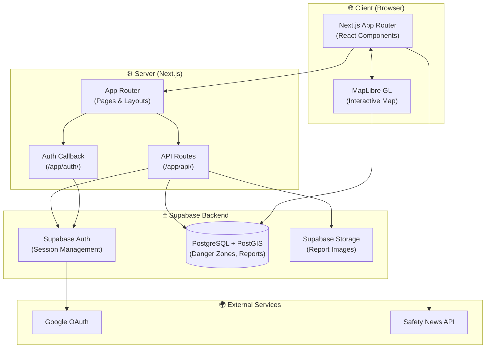

# 🛡️ Dangerless

**Dangerless** helps travelers explore unfamiliar neighborhoods safely. It provides an interactive map with color-coded danger zones, real-time safety news, and allows users to submit safety reports based on their experience.

## ✨ Features

- 🗺️ **Interactive Safety Map** — Color-coded danger zones powered by MapLibre GL
- 📰 **Safety News Feed** — Real-time local news alerts
- 📝 **Safety Reports** — Submit reports with location, severity, and category
- 🔍 **Location Search** — Search any area and view its safety info
- 🔐 **Google OAuth** — Sign in securely with your Google account
- 🌙 **Light/Dark Theme** — Comfortable viewing in any environment
- 📱 **Responsive Design** — Works on both desktop and mobile

## 🛠️ Tech Stack

| Layer     | Technology                             |
| --------- | -------------------------------------- |
| Framework | Next.js 16 (App Router)                |
| Language  | TypeScript 5                           |
| Styling   | Tailwind CSS + Radix UI                |
| Map       | MapLibre GL                            |
| Backend   | Supabase (PostgreSQL + Auth + PostGIS) |
| Testing   | Playwright (E2E)                       |
| CI/CD     | GitHub Actions                         |

## 🏗️ Architecture



### Key Data Flows

| Flow              | Description                                                                                 |
| ----------------- | ------------------------------------------------------------------------------------------- |
| **Auth**          | User clicks "Sign in with Google" → Supabase Auth → Google OAuth → session cookie returned  |
| **Map Render**    | App loads → API fetches danger zones from PostGIS → MapLibre renders color-coded polygons   |
| **Safety Report** | User submits report → API route validates → writes to PostgreSQL + uploads image to Storage |
| **News Feed**     | Client fetches local news → displayed alongside map                                         |

## ✅ Prerequisites

Make sure you have these installed before starting:

- **Node.js** v18 or higher
- **npm** v8 or higher
- **Git**
- **Supabase account** — free at [supabase.com](https://supabase.com/)

Verify your versions:

```bash
node --version   # v18+
npm --version    # v8+
```

## 📦 Installation

```bash
# 1. Clone the repository
git clone https://github.com/parunchxi/dangerless.git
cd dangerless

# 2. Install dependencies
npm install
```

## ⚙️ Configuration

### Environment Variables

```bash
# Copy the example file
cp .env.example .env.local
```

Then fill in `.env.local`:

```env
# Supabase (required)
NEXT_PUBLIC_SUPABASE_URL=your-project-url
NEXT_PUBLIC_SUPABASE_PUBLISHABLE_OR_ANON_KEY=your-anon-key

# Google Sign-In test account (required for E2E tests)
GOOGLE_SIGNIN_EMAIL=your-email
GOOGLE_SIGNIN_PASSWORD=your-password
```

> 💡 Get your Supabase credentials from: **Supabase Dashboard → Your Project → Settings → API**

## 🗄️ Database Setup

> ⚠️ Run these SQL files **before** starting the app.

1. Go to **Supabase Dashboard → SQL Editor**
2. Enable required extensions:

```sql
CREATE EXTENSION IF NOT EXISTS postgis;
CREATE EXTENSION IF NOT EXISTS "uuid-ossp";
```

3. Run the SQL files **in this exact order**:

| Order | File                      | Purpose            |
| ----- | ------------------------- | ------------------ |
| 1     | `database/enum.sql`       | Creates enum types |
| 2     | `database/schema.sql`     | Creates tables     |
| 3     | `database/functions.sql`  | Creates functions  |
| 4     | `database/triggers.sql`   | Creates triggers   |
| 5     | `database/appSetting.sql` | Seeds initial data |

## 🚀 Running the App

```bash
# Development server
npm run dev
```

Open [http://localhost:3000](http://localhost:3000) in your browser.

### Other Useful Commands

```bash
npm run build        # Build for production
npm run start        # Start production server
npm run lint         # Check for lint errors
npm run lint:fix     # Auto-fix lint errors
npm run type-check   # TypeScript type check
npm run clean        # Clear build cache
npm run preview      # Build + start (production preview)
```

## 🧪 Testing

This project uses **Playwright** for end-to-end testing.

### Run tests locally

```bash
# Install Playwright browsers (first time only)
npx playwright install

# Run all E2E tests
npx playwright test

# Run a specific test suite
npx playwright test tests/e2e/auth/auth.spec.js
```

### Test suites

| Suite  | Path                | Covers                    |
| ------ | ------------------- | ------------------------- |
| Auth   | `tests/e2e/auth/`   | Google sign-in / sign-out |
| Form   | `tests/e2e/form/`   | Add & edit safety reports |
| Search | `tests/e2e/search/` | Location search           |

### CI/CD

Tests run automatically on GitHub Actions:

- ✅ On push to `dev` and `feat/map_dev` branches
- ✅ On pull request to `main`

## 📁 Project Structure

```
Dangerless/
├── app/                  # Next.js App Router pages & API routes
│   ├── api/              # API route handlers
│   └── auth/             # Auth callback routes
├── components/           # Reusable UI components
│   ├── controls/         # Map controls
│   ├── modes/            # App modes (view/report)
│   ├── navigation/       # Navigation components
│   ├── search/           # Search components
│   ├── shared/           # Shared components
│   ├── trays/            # Sidebar trays
│   └── ui/               # Base UI primitives (shadcn/ui)
├── database/             # SQL migration files
├── lib/                  # Utility functions & Supabase client
├── tests/e2e/            # Playwright E2E tests
├── types/                # TypeScript type definitions
├── .env.example          # Environment variable template
└── .github/workflows/    # GitHub Actions CI config
```

## 🤝 Contributing

Contributions are welcome! Please follow these steps:

1. **Fork** the repository
2. **Create** a new branch from `dev`:
   ```bash
   git checkout -b feat/your-feature-name
   ```
3. **Commit** your changes with a clear message:
   ```bash
   git commit -m "feat: add your feature description"
   ```
4. **Push** and open a **Pull Request** to `dev`

### Commit Message Convention

Use [Conventional Commits](https://www.conventionalcommits.org/):

| Prefix      | Use for                     |
| ----------- | --------------------------- |
| `feat:`     | New features                |
| `fix:`      | Bug fixes                   |
| `docs:`     | Documentation changes       |
| `style:`    | Formatting, no logic change |
| `refactor:` | Code refactor               |
| `test:`     | Adding or updating tests    |
| `chore:`    | Maintenance tasks           |
